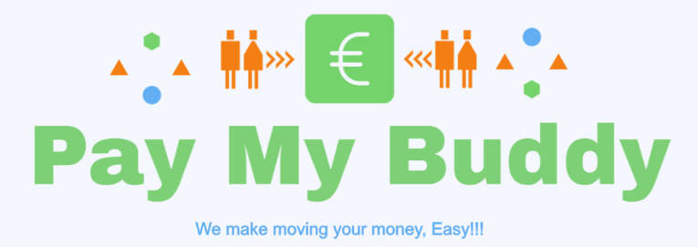
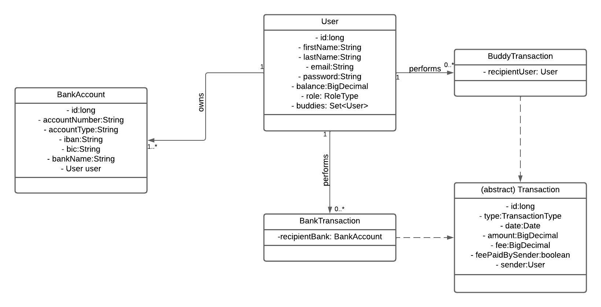
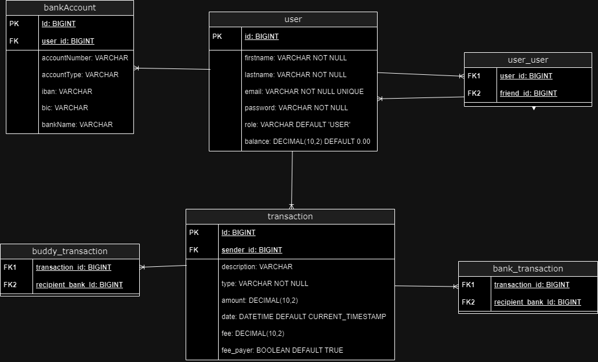

# 
Pay my Buddy

Welcome to Pay My Buddy - a simple solution for managing your finances and easily transferring money to your friends.
In today's world, traditional banking systems often present obstacles when it comes to sending money quickly and conveniently.
Pay My Buddy aims to streamline this process by providing users with a user-friendly platform where they can transfer money to their friends easily.

:exclamation: *This project is part of the "Java Application Developer" training program by OpenClassrooms.* :mortar_board:

## Features

- New users can register and login using **email** as unique identifier.
- Users can add registered people to their *buddy* list using their email addresses.
- At any time, users can **deposit** money into their bank accounts or **withdraw** money from them withing our application.
- Using the available balance, users can make payments to any *buddy*.
- We charge a 0.5% fee for each transaction to monetize the application.

## Installation

Before running the application, you need to clone this repository and set up the database with **MySQL**. The SQL scripts can be found in the 'src/main/resources/db' directory:
1. **schema.sql**: sets up the database schema.
2. **data.sql**: populates the database with some sample data for testing purposes.

These scripts are not mandatory because Hibernate generates the tables automatically as needed, if at least the database exists which is named "**pay_my_buddy_db**".

One the database is set up, you can run the application.

## Configuration

You need to have JDK 21 or later installed on your system.

## Usage

One the application is launched, simply enter the following URL in a web browser: http://localhost:8080

Upon reaching the login page, if you don't have an account, you can register by clicking on "register here". After creating your user account, log in to access the application's features.

In the navigation bar:
- Transfer Page: Allows you to send money to a buddy and view all transactions.
- Profile Page: Contains 3 tabs: user information, buddies management and bank accounts management.
- Contact Page: Allows you to send a message to the administrators.

Additionally, you can log out at any time.

## Documentation

- Logical Data Model:

  
- Physical Data Model:

